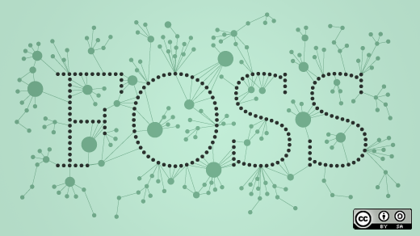
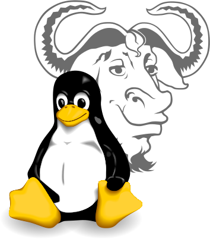
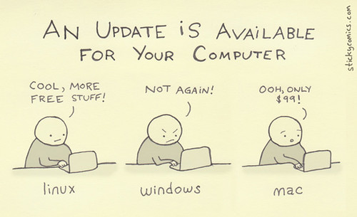

# Table of Contents

1.  [Free and Open-Source Software](#org79bcc39)
2.  [FOSS for Learning and Development](#org6d4dbd5)
3.  [FOSS for Societal progress](#orga346934)
4.  [FOSS alternatives to widely used software](#org42279b7)
5.  [Conclusion](#org4bb75e1)

What does the trending switch-over from WhatsApp to Signal, the public cloud, supercomputers, and the leading mobile operating system worldwide have in common? Signal messenger falls under the category of Free and Open source software. [90 percent of the public cloud](https://www.cbtnuggets.com/blog/certifications/open-source/why-linux-runs-90-percent-of-the-public-cloud-workload) workload runs GNU/Linux, which is Free and Open Source. All the [top 500 super computers run GNU/Linux](https://www.networkworld.com/article/3568616/linux-dominates-supercomputing.html) as their operating system. The most popular mobile Operating System _Android,_ is [Free and Open Source Software](https://www.makeuseof.com/tag/android-really-open-source-matter/).

And it doesn&rsquo;t stop there. Widely used programs like [OBS](https://obsproject.com/), [VLC media player](https://en.wikipedia.org/wiki/VLC_media_player), [Audacity](https://www.audacityteam.org/), [Mozilla Firefox](https://en.wikipedia.org/wiki/Firefox), [Blender](https://www.blender.org/) are all belong to the family of Free and Open-Source Software (FOSS). The trending programming language [Python](https://www.python.org/about/) and the famous web development language [PHP](https://en.wikipedia.org/wiki/PHP) are FOSS. Even [LaTeX](https://www.latex-project.org/), the software cherished by researchers around the world is FOSS.

[Free and open-source software](https://en.wikipedia.org/wiki/Free_and_open-source_software) (FOSS) has become popular worldwide especially over the past 2 decades and its use has become so widespread, that it isn&rsquo;t something that only concerns software developers anymore; it has a significant impact on the society&rsquo;s functioning and our way of life. Even the recent trend in switching over to Signal from WhatsApp messenger has its roots in Signal being FOSS. So let&rsquo;s see what the FOSS is all about!

## Free and Open-Source Software

FOSS is actually an umbrella term for [Free Software](https://en.wikipedia.org/wiki/Free_software) and [Open-source software](https://en.wikipedia.org/wiki/Open-source_software). The [GNU website](https://www.gnu.org/philosophy/free-sw.en.html) defines free software as follows:

> “Free software” means software that respects users&rsquo; freedom and community. Roughly, it means that the users have the freedom to run, copy, distribute, study, change and improve the software. Thus, “free software” is a matter of liberty, not price.

To understand the concept, you should think of “free” as in “free speech,” not as in “free lunch”. There are four essential freedoms associated with all free software.

- The freedom to run the program as you wish, for any purpose (freedom 0).
- The freedom to study how the program works, and change it so it does your computing as you wish (freedom 1). Access to the source code is a precondition for this.
- The freedom to redistribute copies so you can help others (freedom 2).
- The freedom to distribute copies of your modified versions to others (freedom 3). By doing this you can give the whole community a chance to benefit from your changes. Access to the source code is a precondition for this.

While open-source software has a [similar definition](https://en.wikipedia.org/wiki/The_Open_Source_Definition), it is not exactly the same; they [differ on philosophical grounds](https://www.gnu.org/philosophy/open-source-misses-the-point.html). Free software emphasizes on ethics and user rights, while [open source software focuses on marketing and pays little to no attention to user&rsquo;s rights](https://en.wikipedia.org/wiki/Free_software#Naming_and_differences_with_Open_Source). A software is classified as free software and/or open-source software [according to the license it is published in](https://en.wikipedia.org/wiki/Comparison_of_free_and_open-source_software_licences).

Now that we know what it is, let&rsquo;s look into how FOSS effects our lives today.

## FOSS for Learning and Development

What is the biggest difference between the real world and the digital world?

Of course, objects in the real world are tangible while those in the digital world aren&rsquo;t, and who would&rsquo;ve imagined that would be an _advantage_ as we see it in today&rsquo;s _new normal_ of physical distancing? But I&rsquo;m not talking about that, I&rsquo;m talking about an advantage the virtual world has over the real one, an advantage that most people take for granted and is often overlooked. That is, **the ability to duplicate information**.

Say you want 2 t-shirts of the exact same model. You might go to a retailer and buy t-shirts of the same model, and that&rsquo;s something people do in general too. But imagine going to an e-book store to buy 2 copies of the same e-book. Why would you even do that, when you have the ability to simply buy one copy of the book and make another copy of it?

It is crucial to understand this peculiar difference in the digital world, because small differences like these often lead to large consequences. For example, think over the following question.

**_Can you rip apart a building to see its inner workings and learn from it?_**

That might not be possible with infrastructure in real life, but that need not be the case with _digital infrastructure_. If this infrastructure i.e. _the source code_ is accessible, the ability to duplicate digital content gives us the power to make a copy of the source code, see how it works, and even experiment with it!

Theory lays the foundation for engineering, but practice is where an engineer takes inspiration from. As an aspiring engineer, what&rsquo;s a better way to understand something than to tinker with it? The software freedoms provided by FOSS enables learning by doing, and this spirit is carried forward by those who use it.

Another direct consequence of effortlessly duplicating information is the ability to **share information**. This ability gave birth to E-mail, Digital news, social media, [memes](https://www.youtube.com/watch?v=ixY5SrGHb7I), [music](https://www.youtube.com/watch?v=_8Gx6AFMJ9U) and [creative content that one can&rsquo;t even begin to explain](https://youtu.be/rrZi125UOUY). This enabled the community to create and maintain widely used and trusted knowledge bases like [Wikipedia](https://en.wikipedia.org/wiki/Main_Page) and [Stack Exchange](https://stackexchange.com/sites#), information exchange sites like [Quora](https://waxy.org/2018/12/why-you-should-never-ever-use-quora/), software collaboration suites like GitHub, and many more.

FOSS makes use of sharing information to the maximum possible extent. By the virtue of the freedoms associated with FOSS, anyone can make a copy of (or _fork_) publicly available source code, modify it to make it better, and share it back to the community so other people can use it for their needs or contribute to the software in a similar manner. This _community driven development_ has the potential to lead to higher rates of development, higher than this world has ever seen, and the emergence of FOSS in the last two decades is the proof of that statement.

## FOSS for Societal progress

The exceedingly trending WhatsApp exodus and switch-over to Signal messenger seems to have resulted from a [single tweet](https://www.thenationalnews.com/arts-culture/will-one-tweet-from-elon-musk-be-enough-to-help-signal-dethrone-whatsapp-as-the-messenger-app-of-choice-1.1143481) by the newly crowned richest man in the world. The recent [change in WhatsApp&rsquo;s policy](https://www.miragenews.com/whatsapp-rolls-mandatory-share-your-data-with-facebook-update/?utm_source=miragenews&utm_medium=miragenews&utm_campaign=news) seems to have triggered this reaction. However, there might be more to that.

WhatsApp is [Freeware](https://en.wikipedia.org/wiki/Freeware), and unlike FOSS, it doesn&rsquo;t make its source code available. This has a few consequences. Firstly, if WhatsApp says they made changes to their policy, we have no choice but to believe that their actions are legally bound to their policy and take their word for it. If we want to continue using this app, we must agree to their policy changes. Many companies like Microsoft and Google have been very clear in their [privacy policies about mishandling user data](https://www.sync.com/blog/top-5-worst-privacy-policies-youve-probably-agreed-to/), but have managed to gain traction owing to popular use, rich features, and red tape over their T&C and privacy policy. Secondly, if companies selling Freeware decides to stop development, that will mark the end of that software. Users have to switch to an alternative or build new software from scratch.

FOSS however doesn&rsquo;t have this problem. Since the source code is available, any changes the company/maintainer of the software says it made is reflected in the source code. Source code acts as a proof of any change made to the software. On top of that, it enables anyone to view the source code and check for malicious features if any.

Also, no one has to worry about any FOSS going extinct. If a company decides to stop developing a software or implements features that are undesirable to users, anyone from the community can simply _fork,_ i.e. make their own copy of the software&rsquo;s source code, and start maintaining it themselves. [LibreOffice](https://www.libreoffice.org/) (a popular FOSS alternative to Microsoft Office) is one such community developed project [born this way](https://en.wikipedia.org/wiki/LibreOffice#History).

It doesn&rsquo;t stop there. The community driven nature of FOSS enables the community to take control over their data and activity on the internet. Take a look at WhatsApp for instance. WhatsApp has a centralized structure, i.e. all communication must pass through WhatsApp&rsquo;s servers before reaching the intended recipient. This enables WhatsApp or any other centralized software to use this data however they wish, which lead to controversies over issues like undesirable personalized advertisements, privacy invasion, users rights violation.

People decided to take matters into their own hands, and this led to the rise of _decentralized communication_. This [encompasses a range of communication techniques](https://decentpatterns.xyz/report/#key-terms) like [P2P](https://en.wikipedia.org/wiki/Peer-to-peer) and [federated networks](<https://en.wikipedia.org/wiki/Federation_(information_technology)>) that prevents a single entity to have control over user data. Apps like [Tox](https://tox.chat/index.html) that use P2P, or _Peer to Peer_ communication, lets the user communicate directly with another user without the need of a middleman. Federated networks used by the [Fediverse](https://en.wikipedia.org/wiki/Fediverse) software platforms, like [Mastodon](https://joinmastodon.org/) (alternative to Twitter) and [Pixelfed](https://pixelfed.org/) (alternative to Instagram) among others, allow for the interconnection of multiple networks across the world.

## FOSS alternatives to widely used software

Personal preference isn&rsquo;t the only reason for someone to start using FOSS. It&rsquo;s a symbol, a step we take towards the direction we want the society to head in.

Also, it&rsquo;s cool.

Luckily, starting to use FOSS is many times more convenient today that what it was 10 years ago. GitHub has been the center for collaboration and the home of millions of software with a wide range of features and target groups. This paved the way for the widespread use and adoption of FOSS across the world, either directly or indirectly.

Let&rsquo;s take a look at PCs for example. People are beginning to use [Linux even in personal computers/laptops](https://www.quora.com/Why-do-people-use-Linux-on-their-PCs?share=1), as an [alternative for the popular Windows OS](https://www.freecodecamp.org/news/i-switched-from-windows-to-linux-here-are-the-lessons-i-learned-along-the-way-434da84ab63f/). No two people use their computers the exact same way, and this simple fact led to [hundreds of Linux based operating systems](https://itsfoss.com/what-is-linux/), each having their own target user group. There are distributions like [Ubuntu](https://ubuntu.com/), [Linux Mint](https://linuxmint.com/) and the recently trending [Manjaro](https://manjaro.org/) that target beginners and provide a user-friendly experience, while distros like [Gentoo](https://www.gentoo.org/) and [Arch Linux](https://archlinux.org/) target those who want precise control over their device.

There are FOSS alternatives to other widely used software, even for online services like the Google search engine, OneNote, Gmail, and they are growing faster every day. You can find such alternatives [here](https://www.linuxjournal.com/content/foss-software-alternatives-popular-proprietary-software) and [here](https://lifehacksthatwork.com/a-massive-list-of-free-software-alternatives/).

## Conclusion

Some people might be people wondering, why is FOSS not popular? It actually is. [Google uses Open Source Software](https://opensource.google/) in most of its products. Even Microsoft, the company that relentlessly tried to undermine Linux throughout history, [joined the Linux foundation](https://www.zdnet.com/article/microsoft-completes-its-linux-journey-joins-the-linux-foundation/) in 2016 and [started using Linux](https://www.wired.com/2015/09/microsoft-using-linux-run-cloud/) in its services.

But the potential for growth that FOSS possesses doesn&rsquo;t belong with these companies, it belongs to the community. The world&rsquo;s most popular software hosting platform GitHub banning youtube-dl, a software developed by the community, wasn&rsquo;t taken lightly by many, especially when GitHub warned that [it would ban accounts of users](https://www.bleepingcomputer.com/news/software/github-threatens-to-ban-users-who-bypass-youtube-dl-takedown/) if they upload banned content. Although the ban was deemed unnecessary [and was lifted soon](https://www.theverge.com/2020/11/17/21571473/github-youtube-dl-downloader-riaa-copyright-1201-takedown-reinstated), it was a reminder to software developers that they weren&rsquo;t in control of the software they develop, which drove them to shift to FOSS alternatives like [GitLab](https://about.gitlab.com/) and [SourceHut](https://sourcehut.org/).

Free and open-source software lets us become both users and contributors. It lets us take control of our activity on our personal devices, and on the internet. And the recently trending shift to Signal might be the beginning of a better future.
