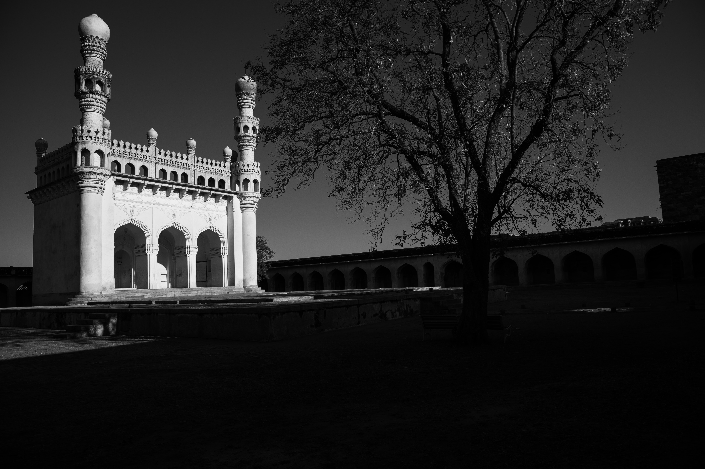
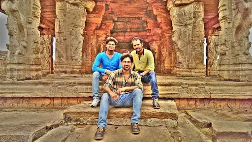

Only 200 kilometers away from the IIT Tirupati campus, there’s a place that will take your breath away as you experience one of the most marvelous sites of India, and in our very own Andhra Pradesh- GANDIKOTA!!!

The beautiful sites of Gandikota not only represent the beautiful old archaeology of India but also the scenery and natural glimpse of the Penna (Pennar) river. The peaceful atmosphere at the Grand Canyon of Gandikota is perfect for refreshment after a long week of working or studying. A few organizers also provide camping on the riverside. Night-stays inside tents and bonfires provide a memorable experience with friends and family to enjoy with. 

Gandikota fort (which is a small sand fort) was founded by a subordinate of the 12th century A.D. Kalyani Chalukya dynasty, Kaka Raja, and [Pemmasani Ramalinga Nayudu](https://en.wikipedia.org/wiki/Pemmasani_Ramalinga_Nayudu) (which is a fort of 101 towers) was founded by the Chola Dynasty. Madhava and Ranganatha are the main idols present in the temple. A heritage festival is also organized in the fort area in October every year. 

Gandikota is well connected by roads from nearby towns i.e. Anantapur, Kadapa, and Tirupati, and 15 km from Jammalamudugu. The nearest main railway station is Muddanuru which is 26 km. Students and youngsters usually like to visit the site by bike to feel the fresh mist in the air. For adventure lovers, the trekking towards the river situated in the canyon can be extremely memorable because it provides a glimpse similar to the Grand Canyon of the USA.

After reaching the site, it felt like we had entered the 12th century. The temple, fort, and mosque, took us back to the glorious era of the beautiful monuments from way back in time. We also witnessed handmade boats of the locals being used for catching fish in the main river. Villagers of surrounding villages are also very helpful to tourists and visitors.

Other attractions nearby the site are Jamia Masjid, Museum, Gandikota Dam, Mylavaram Dam, etc. Although tourists visit the site all around the year, the best time period to visit the site is between November and February when the weather is cooler.

So friends, what are you waiting for? Go on a weekend trip to Gandikota and feel the historical beauty of nature!!!

