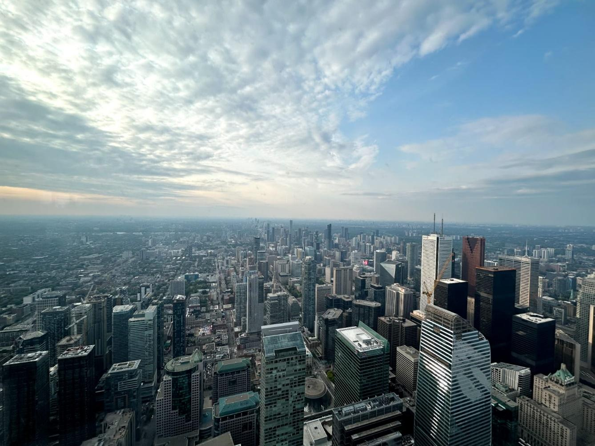
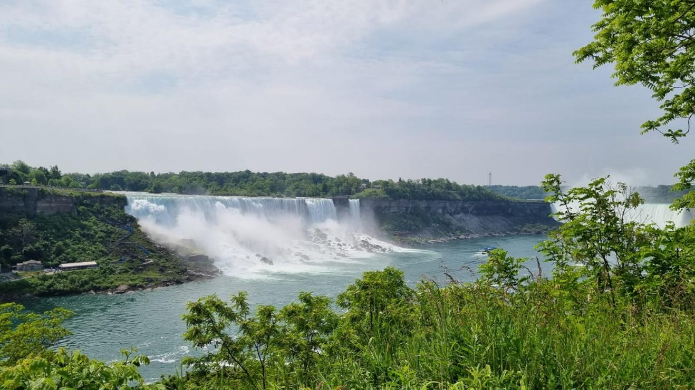

<!--StartFragment-->

The adventure began during the evening snack time at the mess in my second year of B.Tech. It was then that I crossed paths with Srikarah, a senior student. Curious about his plans, I inquired about his upcoming internship. He told me about the research internship opportunity in Canada offered by Mitacs, which immediately caught my attention. With Srikarah's guidance, I aimed for the exciting possibility of embarking on an international research internship in Canada.

When September arrived, the chance to apply for the Mitacs GRI research internship in Canada emerged, and I promptly completed the application form without any hesitation.

In the second week of September, I submitted an application for the program. The application process involves providing personal information as well as details on past accomplishments/research/projects. A current CV is also required. Additionally, a minimum of one recommendation letter is necessary. I secured one of my recommendation letters from Dr. Prasanna Venkatesh Sampath, who taught two of my courses and supervised my research project during that period. The other letter was obtained from Dr. Anup Basak, who instructed two of my courses.

Fortunately, I successfully passed the initial round and received an interview invitation from the project supervisor who was my top preference. The interview was more casual than I expected. The professor inquired about the alignment of my interests and posed some questions related to the project's field. Our discussion also touched on topics such as the weather in India and Canada.

Days passed, and the anticipation built up as I waited for a response from Mitacs GRI. Finally, on a faithful December morning, my patience bore fruit. I received the news I had been yearning for – I was accepted into the program! My heart raced as I opened the email from Mitacs GRI. My eyes raced through the lines, and as I processed the message, an overwhelming surge of happiness washed over me. I couldn't contain my excitement and squealed in joy. The joy and excitement knew no bounds as I shared the news with my family, professors, and friends.

As the dates approached, the formalities and processes began to fall in place.. I borrowed funds from benevolent professors to organize my flight reservation, and I wish to express my gratitude to Dr. Prasanna Venkatesh Sampath, Dr. B Janaki Ramaiah, Dr. A. Murali Krishna, Dr. Shihabudheen M. Maliyekkal, Dr. M. Nithyadharan, and Dr. Gowri Asaithambi this matter.

Fortunately, the visa application progressed without any hitches. Eventually, equipped with my passport and tickets, I was all set. The emigration process was a breeze, especially after the emigration officers noticed my passport's "IIT" inscription, resulting in a smoother and more amicable process.

During our journey, we had a layover of 20 hours in Cairo, Egypt. We took the opportunity to explore the Pyramid and the Nile River. Afterward, we touched down in Toronto and our workdays commenced.

During this time, I tried my hand at cooking for the first time, and the results were promising. This newfound culinary competence followed me on the subsequent three-month tour, during which I made my own meals. Aside from the work and research, I was exposed to a life in which I was put in charge of what I wanted to do everyday.

Our guide proved to be incredibly supportive. Moreover, we had diverse plans for weekends, including visits to attractions like Niagara Falls, the Royal Ontario Museum, Casa Loma, CN Tower, a Cruise excursion, Grand Bend Beach, the Aquarium, and Toronto Zoo.

Additionally, our professor orchestrated potluck gatherings in local parks, where each participant contributed different dishes, fostering a sense of communal sharing and unity. These occasions often involved friendly soccer and badminton matches that brought us all closer together.

And so, this journey of mine to Canada was a mix of hard work, exciting discoveries, and making new friends. It showed me that with determination, dreams do come true, even if it means stepping out of your comfort zone.

As for my project work, I was chosen to participate in a research project on “Stormwater infrastructure design in light of climate change in southern Ontario”. The research took place at Western University in Ontario, Canada, under the guidance of Professor Dr. Mohammad Reza Najafi. The study involved predicting future water runoff while accounting for the influence of climate change by creating a hydrological model, as well as developing strategies for managing stormwater to lessen its climate change implications.

The research aims were met through weekly meetings where we received comments from Professor Najafi and other Ph.D. scholars and postdoc students. We also discussed the same during weekly potluck gatherings hosted by students of the Hydro Climax team.

<!--EndFragment-->